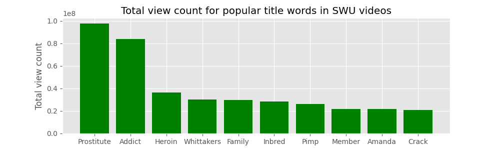
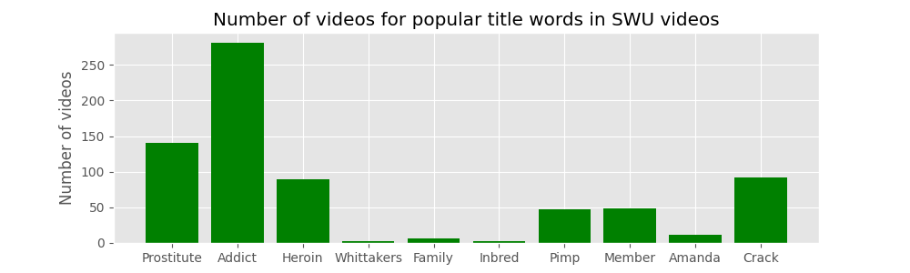

# Soft White Underbelly title view count analyser

This is a simple script which parses a saved HTML file of the [Soft White Underbelly YouTube channel page](https://www.youtube.com/c/SoftWhiteUnderbelly/videos), pulls out the video titles and corresponding view counts, and then plots a bar chart of the sum of the views for the videos in which a word occurs vs. the most popular words. It also counts and plots the number of videos in which each of those words occurs to help contextualise the view count. I used a saved HTML file because I couldn't be bothered farting around with getting the right API keys and setting up the Python client. I've also excluded some words which came up in the parsing process which weren't of interest (e.g. 'and', 'The', etc.). (Note I've deleted the HTML file itself from the repo because it had details of my account name in it. You can generate the same thing by just scrolling down on the above link till you hit the bottom, then right-click saving it to `/data/swu.html` in the repo directory).

Soft White Underbelly presents frank interviews with people at the fringes of society, discussing often taboo or distressing topics. I believe that the creator's intent is indeed a positive one, but I wonder whether by classifying the 'type' of person in the video title (e.g. 'Prostitute', 'Addict', etc.) leads to a kind of algorithmic voyeurism, where YouTube will notice that people will tend to select more salacious titles and thereby continue to recommend those types of videos. 




I think the outcome here of 'prostitute' being the most popular word but actually used in fewer videos than 'addict' could be indicative of the kind of voyeurism I was proposing. If there are more videos with 'addict' in the title than 'prostitute' then is it simply the quality of the human story content which is driving users to watch the 'prostitute' videos more often? Or, is the userbase more likely to watch 'prostitute' videos because of a salacious interest in the topic? And, if this were the case, to what extent would this undermine SWU's stated aim to give a voice to vulnerable people? Perhaps the creator is aware of this and is capitalising on it to better spread his message of compassion towards the vulnerable. Or is he cynically exploiting his interviewees by giving them crass labels to get clicks?

I'm not sure I know the answer, but I think there's wider discussion to be had on this very popular YouTube channel.

## Installation

Use the package manager [pip](https://pip.pypa.io/en/stable/) to install requirements.

```bash
pip3 install -r requirements.txt
```

## Usage

```bash
python3 main.py
```
